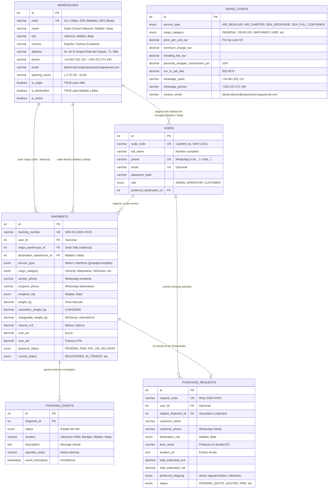
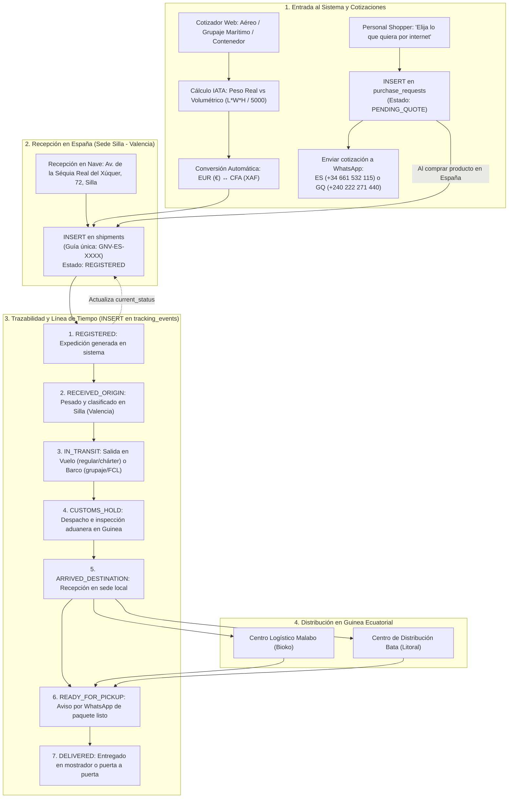

# Arquitectura de Datos y Diagramas de Flujo - Exportaciones Guineval S.L.

Este documento contiene la documentación gráfica y técnica del modelo relacional definido en [`server/src/database/schema.sql`](../server/src/database/schema.sql), ajustado con los datos corporativos oficiales de **Exportaciones Guineval S.L.**:

- **Sede Central de Salida (España):** Av. de la Séquia Real del Xúquer, 72, 46460 Silla, Valencia.
- **Teléfonos de Contacto / WhatsApp:**
  - **España:** `+34 661 532 115`
  - **Guinea Ecuatorial:** `+240 222 271 440`
- **Email Corporativo:** `daniel.alonso@exportacionesguineval.com`
- **Destinos en Guinea Ecuatorial:** Malabo (Isla de Bioko) y Bata (Litoral / Continental).
- **Línea Estratégica (Personal Shopper):** *"Elija lo que quiera por internet y nosotros lo compramos y se lo enviamos a Guinea Ecuatorial"*.
- **Servicios Clave:**
  - Contenedores completos (FCL) y compartidos/grupajes (LCL).
  - Vuelos regulares y chárter de carga.
  - Especialistas en: vehículos/camiones, maquinaria pesada, mobiliario/electrodomésticos, material de construcción (baldosas) y mercancías peligrosas (ADR).

---

## 1. Diagrama Entidad-Relación (ER)

---

## 2. Diagrama de Flujo Operativo y Ciclo de Vida del Paquete

---

## 3. Identidad Visual para el Frontend (SASS)

Tomando como referencia los elementos de marca de la empresa:
- **Fondo primario oscuro (Navy Blue):** `#141729` (profesional, logístico y moderno).
- **Acento ámbar / dorado corporativo:** `#f5a623` / `#e5a823` (botones de acción, iconos de contacto y destacados).
- **Color secundario:** `#2a3152` para tarjetas y contenedores.
- **Tipografía de cabeceras:** Tipografía bold condensada/impactante (`Outfit` / `Barlow Condensed` / `Inter`).
- **Integración flotante:** Botón de chat rápido directo a los números oficiales de WhatsApp España (`+34 661 532 115`) y Guinea Ecuatorial (`+240 222 271 440`).
